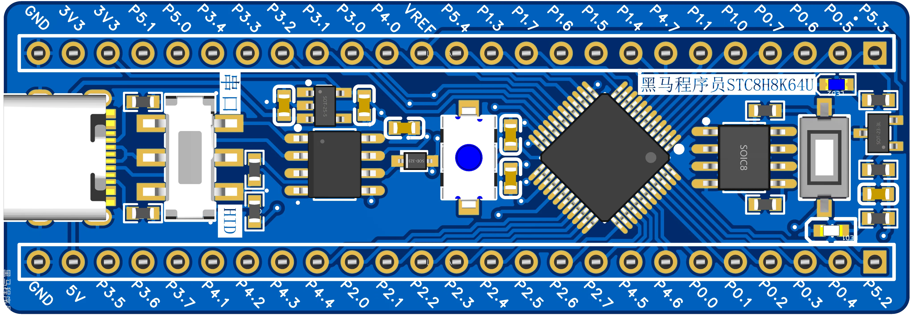
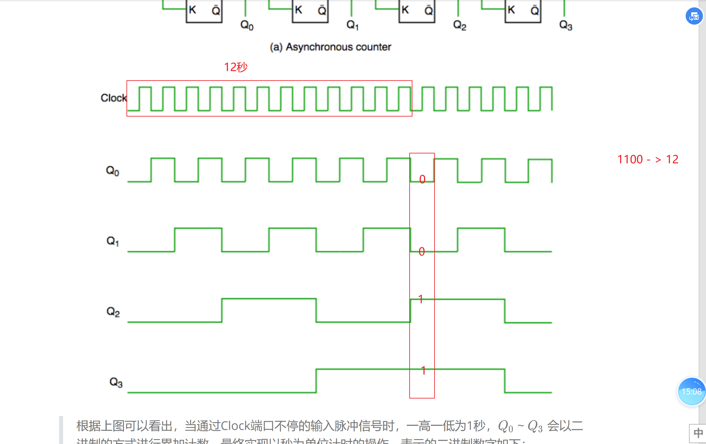

# Embedded Systems Foundations

## Overview

电子电路、数字逻辑、简化 CPU 与基础硬件控制实验。仓库包含 CircuitJS 电路、Digital 工程、STC8 控制程序、原理图和 BOM，内容从基础器件一直延伸到 CPU 的取指、解码与执行。

## Architecture

```text
电子器件与电路
      ↓
逻辑门 → 加法器 → ALU
      ↓
锁存器 / 寄存器 / Memory
      ↓
PC / MAR / MBR / IR / Control Unit
      ↓
简化 CPU 取指、解码与执行
```

CPU 工程采用 8 位数据通路和 4 位地址空间。手动版本用于逐步切换 WE/OE 与总线状态，自动版本通过时钟、计数器和查找表执行 `LOAD_A → LOAD_B → ADD → STORE`。

## Hardware Preview

| STC8 开发板结构参考 | 四位异步计数器时序 |
| --- | --- |
|  |  |
| **CPU 取指与数据通路** | **UART 音频模块接口** |
|  |  |

图片与工程文件的对应关系见 [assets/README.md](assets/README.md)。

## Technical Highlights

| 主题 | 内容 |
| --- | --- |
| [电子电路基础](projects/01_电子电路基础/README.md) | 串并联、整流、LED、继电器、三极管、MOS、比较器与双稳态电路 |
| [数字逻辑与组合电路](projects/02_数字逻辑与组合电路/README.md) | 逻辑门、半加器、全加器、8 位加法器、ALU 加法通路和三态输出 |
| [计算机组成与 CPU](projects/03_计算机组成与CPU/README.md) | PC、MAR、Memory、MBR、IR、寄存器、总线和 17 位控制字 |
| [原理图与 PCB 设计](projects/04_原理图与PCB设计/README.md) | 原理图阅读、器件清单、关键网络与 PCB 设计流程 |
| [嵌入式硬件控制](projects/05_嵌入式硬件控制实践/README.md) | STC8 GPIO、按键、PWM、LED、蜂鸣器、电机和 UART 音频控制 |
| [NE555 电子琴](projects/06_综合实践/01_NE555电子琴/README.md) | 用可切换电阻支路改变 NE555 振荡频率 |
| [旅游解说仪](projects/06_综合实践/02_旅游解说仪/README.md) | STC8 通过 UART 控制 CH7800 音频模块 |

## Build / Run

- .txt：导入 CircuitJS 查看电路。
- .dig：使用 Digital v0.30 打开；主工程与自定义子电路需保持原目录关系。
- .hd：使用支持 STC8 的天问 Block 环境打开。
- .xlsx：BOM 与器件清单。
- .svg：原理图和接口图，可直接在浏览器查看。

## Project Structure

    projects/
    ├─ 01_电子电路基础/
    ├─ 02_数字逻辑与组合电路/
    ├─ 03_计算机组成与CPU/
    ├─ 04_原理图与PCB设计/
    ├─ 05_嵌入式硬件控制实践/
    └─ 06_综合实践/
    docs/              CPU、PCB 与验证说明
    assets/images/     板卡、数字逻辑、CPU 与接口图

PCB 部分聚焦原理图分析、BOM 和设计流程，当前工程范围到设计输入与网络检查。

## Documentation

- [嵌入式基础技术路线](docs/嵌入式基础技术路线.md)
- [数字逻辑到 CPU](docs/数字逻辑到CPU.md)
- [PCB 设计流程](docs/PCB设计流程.md)
- [调试与验证](docs/调试与验证.md)
- [来源与许可](THIRD_PARTY_NOTICES.md)

## Related Projects

- [Embedded-C-Cpp-Learning](https://github.com/REliasCheng/Embedded-C-Cpp-Learning)：C/C++、模块接口与状态机。
- [STC8-MCU-Learning](https://github.com/REliasCheng/STC8-MCU-Learning)：STC8 外设与任务协作工程。
