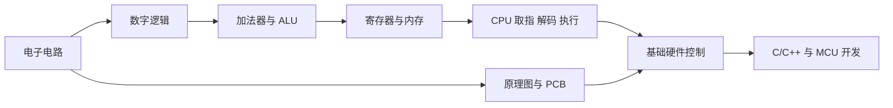
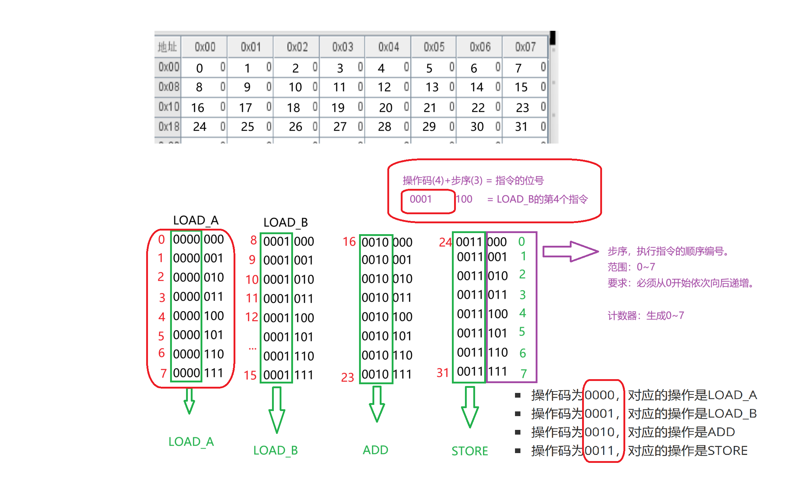
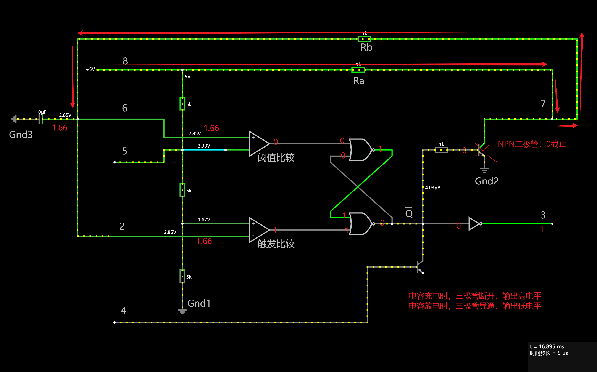
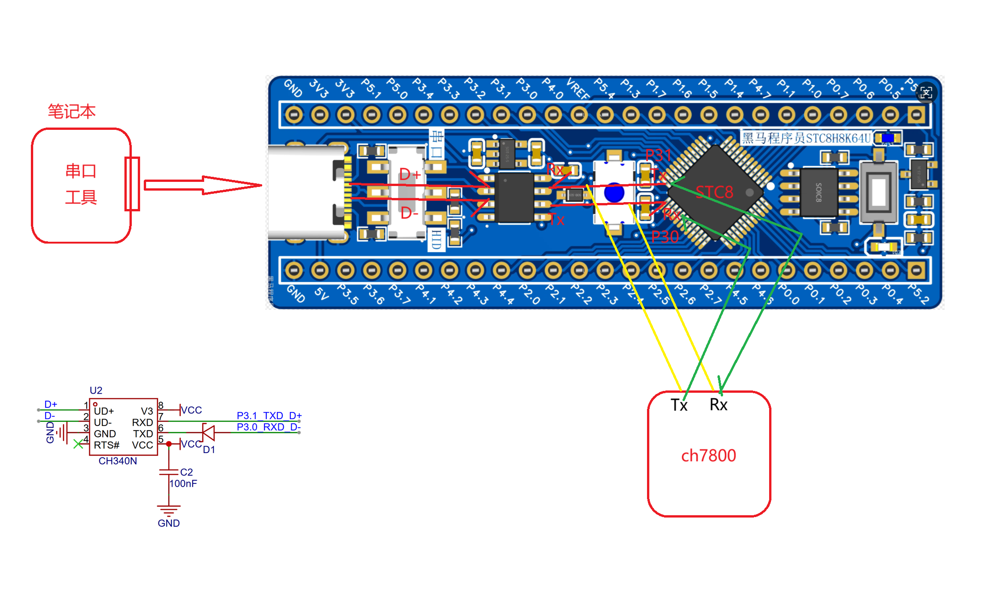

# Embedded Systems Foundations

嵌入式系统基础：电子电路、数字逻辑、计算机组成与硬件实践

这是我的嵌入式系统基础技术实践仓库。从电压、电流和基础器件出发，经由逻辑门、加法器、寄存器与总线，继续完成简化 CPU 模型、原理图/PCB 流程分析和 STC8 硬件控制实践。仓库保留可继续打开的电路仿真、数字逻辑工程、图形化程序、BOM 与原理图证据，并用工程文档说明它们之间的关系。

## 技术能力地图



## 项目展示

| CPU 取指与数据通路 | NE555 充放电状态 | UART 音频模块接口 |
| --- | --- | --- |
|  |  |  |

这些图片来自现有课程工程与配套分析资料，用于把电路状态、CPU 数据流和硬件接口与仓库中的工程文件对应起来。

## 核心能力

| 技术方向 | 仓库中的实践 | 入口 |
| --- | --- | --- |
| 电子电路 | 串并联、LED、整流、继电器、三极管、MOS、比较器与双稳态触发 | [电子电路基础](projects/01_电子电路基础/README.md) |
| 数字逻辑 | 基本门、半加器、全加器、8 位加法链、加法通路 ALU、Verilog/VHDL 对照 | [数字逻辑与组合电路](projects/02_数字逻辑与组合电路/README.md) |
| 计算机组成 | 锁存器、寄存器、内存寻址、PC、MAR、MBR、IR、数据总线与控制序列 | [计算机组成与 CPU](projects/03_计算机组成与CPU/README.md) |
| 硬件设计 | 原理图阅读、器件与 BOM、布局布线要点及制造资料边界 | [原理图与 PCB 设计](projects/04_原理图与PCB设计/README.md) |
| 硬件控制 | STC8 GPIO、按键、PWM、LED 灯组、蜂鸣器、振动电机和 UART 音频控制 | [嵌入式硬件控制实践](projects/05_嵌入式硬件控制实践/README.md) |
| 综合实践 | NE555 电子琴与基于 CH7800 的旅游解说仪控制链 | [综合实践](projects/06_综合实践/README.md) |

## 代表项目

### 简化 CPU 自动运行模型

从 4/8 位寄存器、加法通路 ALU、PC 和内存开始，建立 8 位数据通路和 4 位地址空间。手动版本用于观察 WE/OE 与数据流，自动版本用时钟、计数器和查找表组织 17 位控制字，串联 `LOAD_A → LOAD_B → ADD → STORE` 的取指、解码和执行过程。

[查看 CPU 工程与结构分析](projects/03_计算机组成与CPU/README.md)

### NE555 电子琴设计实践

基于 NE555 无稳态振荡过程分析电容充放电、阈值切换、频率与占空比，并通过不同电阻支路改变输出频率。仓库保留 CircuitJS 电路、器件 BOM 和关键状态图。

[查看 NE555 电子琴](projects/06_综合实践/01_NE555电子琴/README.md)

### 旅游解说仪控制实践

围绕 STC8 与 CH7800 语音模块建立控制链：UART1 使用 P3.0/P3.1、9600 波特率传输 7 字节控制帧，按键触发上一曲、下一曲、播放与暂停；BOM 和接口图说明控制板与语音模块的硬件关系。

[查看旅游解说仪](projects/06_综合实践/02_旅游解说仪/README.md)

## 仓库结构

```text
projects/
├─ 01_电子电路基础/          CircuitJS 电路与器件分析
├─ 02_数字逻辑与组合电路/    Digital 工程与 HDL 对照
├─ 03_计算机组成与CPU/       数据通路、控制序列与程序镜像
├─ 04_原理图与PCB设计/       原理图、BOM 和设计流程
├─ 05_嵌入式硬件控制实践/    STC8 图形化控制程序
└─ 06_综合实践/              NE555 电子琴与旅游解说仪
docs/                        技术路线、CPU 链路、PCB 流程与验证方法
```

主题目录中的 `course/` 保存课程实践原文件；README 和 `docs/` 是我的分类、分析与工程说明。来源边界集中记录在 [THIRD_PARTY_NOTICES.md](THIRD_PARTY_NOTICES.md)。

## 如何查看工程

- CircuitJS 电路：将 `.txt` 文件导入 CircuitJS。
- Digital 工程：使用 Digital v0.30 打开 `.dig`；自定义子电路文件应与主工程保持同一目录。
- 天问图形化程序：使用支持 STC8 的天问 Block 环境打开 `.hd`。
- BOM：使用 Excel 或兼容表格工具查看 `.xlsx`。
- 原理图：SVG 可直接在浏览器查看。

工具安装包没有进入仓库。环境和验证边界见[调试与验证](docs/调试与验证.md)。

## 与其他仓库的关系

| 仓库 | 能力定位 |
| --- | --- |
| **Embedded-Systems-Foundations** | 基础电子、数字逻辑、计算机组成与硬件设计 |
| [Embedded-C-Cpp-Learning](https://github.com/REliasCheng/Embedded-C-Cpp-Learning) | C/C++ 与程序设计能力 |
| [stc89c52-learning](https://github.com/REliasCheng/stc89c52-learning) | 51 单片机与常用外设驱动 |
| [BlueBridgeCup-MCU](https://github.com/REliasCheng/BlueBridgeCup-MCU) | 单片机竞赛与综合工程实践 |

## 后续方向

在现有基础上继续补充真实仿真截图、PCB 设计文件和实物验证记录，并将能力链延伸到 STM32、FreeRTOS 与 Embedded Linux。后续内容只在形成源码、工程或测试证据后加入现有成果。
