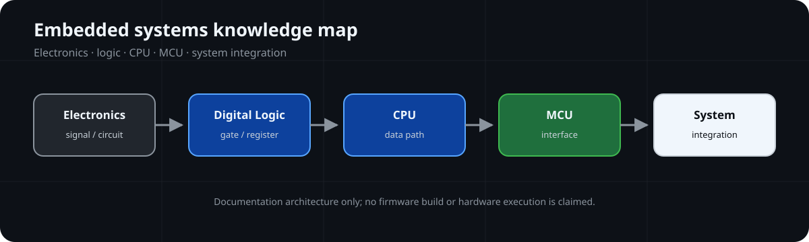
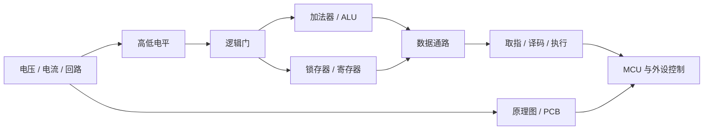

# Embedded-Systems-Foundations

从电子电路、数字逻辑和简化 CPU 出发，连接到 PCB 设计与 MCU 控制的嵌入式系统基础文档库。



## Project Snapshot

| Field | Value |
| --- | --- |
| Language | Markdown / Technical Documentation |
| Platform | Embedded Systems Concepts；通用数字逻辑、简化 8 位 CPU 与 8051/STC8 接口示例 |
| Toolchain | Documentation-oriented；不包含固件或 EDA 构建工具链 |
| Architecture | Electronics → Digital Logic → CPU Architecture → MCU / PCB Integration |
| Verification | Documentation structure、technical relationships 与 internal navigation review |

> **Project status:** Knowledge architecture documented · Executable build and runtime not applicable · Hardware validation not performed

## Overview

仓库强调信号如何从电压与逻辑门逐层进入寄存器、总线、控制序列和真实硬件接口，为后续 MCU、RTOS 和硬件设计项目提供概念索引。

文档使用通用数字逻辑和简化 8 位 CPU 模型解释数据通路，并以 8051/STC8 类 MCU 的 GPIO、PWM、UART 控制作为硬件接口示例。仓库不绑定某一块开发板，也不提供特定芯片的可构建固件。

## Architecture

这里展示的是知识架构，不是软件模块或驱动层架构。


```mermaid
flowchart LR
    A[电压 / 电流 / 回路] --> B[高低电平]
    B --> C[逻辑门]
    C --> D[加法器 / ALU]
    C --> E[锁存器 / 寄存器]
    D --> F[数据通路]
    E --> F
    F --> G[取指 / 译码 / 执行]
    A --> H[原理图 / PCB]
    G --> I[MCU 与外设控制]
    H --> I
```

## Key Features

| Knowledge Area | Coverage |
| --- | --- |
| Circuit Fundamentals | 电源、回路、二极管、晶体管、MOS 与波形观察 |
| Digital Systems | 真值表、加法器、三态总线、锁存器与寄存器 |
| CPU Architecture | ALU、MAR/MBR/IR、内存、程序计数器与控制序列 |
| PCB Design Concepts | 需求、BOM、原理图、布局布线、ERC/DRC 与制造检查 |
| MCU Concepts | GPIO、PWM、UART、引脚和负载接口的验证思路 |
| Embedded Learning Path | 从电路基础延伸到 MCU、RTOS 与硬件设计项目的知识导航 |

## Project Structure

```text
docs/
  嵌入式基础技术路线.md
  数字逻辑到CPU.md
  PCB设计流程.md
  调试与验证.md
```

本仓库定位为架构与工程方法文档，不提供可构建的固件、EDA 工程或板级驱动。

## Documentation

| 文档 | 关注点 |
| --- | --- |
| [嵌入式基础技术路线](docs/嵌入式基础技术路线.md) | 从电路到 CPU 与 MCU 的整体关系 |
| [数字逻辑到 CPU](docs/数字逻辑到CPU.md) | 加法器、寄存器、总线、内存与简化指令流程 |
| [PCB 设计流程](docs/PCB设计流程.md) | 需求、选型、原理图、布局布线与生产检查 |
| [调试与验证](docs/调试与验证.md) | 仿真、逻辑验证、控制程序与硬件证据边界 |

## Verification

### Host Test

**Status:** Not Applicable. 仓库不包含可执行源代码或主机测试。

### Build Verification

**Status:** Not Applicable. 仓库不包含固件、EDA 或软件工程构建。

### Hardware Validation

**Status:** Not Performed. 仓库没有板级运行、硬件测试或仿真工程结果。

### Runtime Evidence

**Status:** Not Applicable. 仓库用于知识整理和技术导航，不包含程序运行证据。

当前验证限于文档结构、技术关系与内部导航检查；这些检查不等同于可执行测试、构建或硬件验证。

## License Boundary

根目录 [MIT License](LICENSE) 适用于仓库维护者编写的文档。外部软件、芯片/器件资料、课程材料、原理图和未随仓库分发的工程文件不因被引用而纳入该许可。
