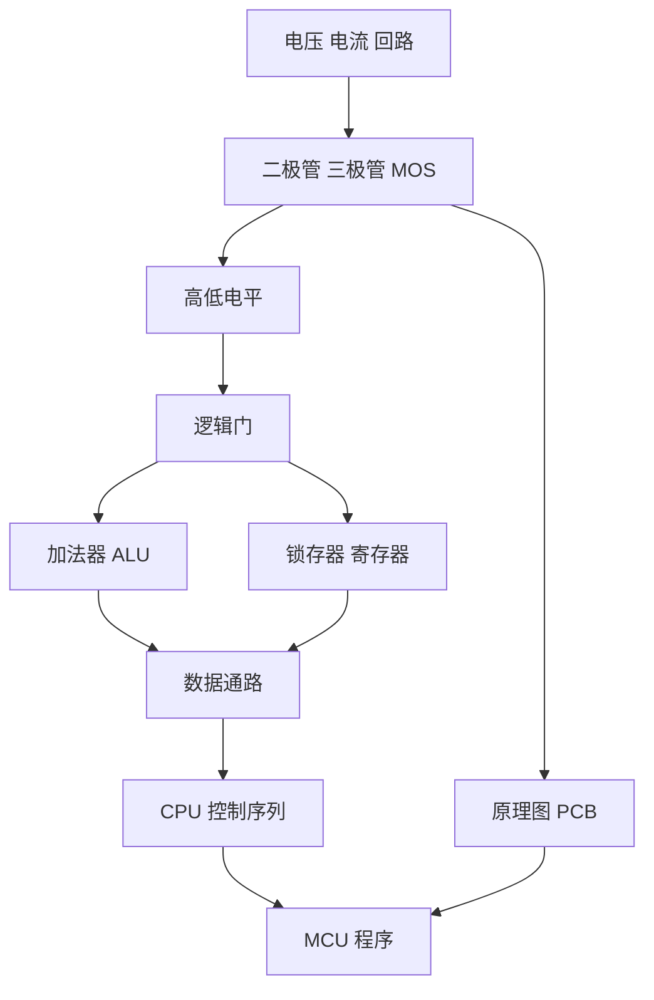

# 从电路到 CPU

## 信号链

1. **电子电路**解释电源、回路、压降、分流和器件导通条件。
2. **数字逻辑**把稳定电压区间抽象为 0/1，用逻辑门实现布尔运算。
3. **组合与时序电路**用加法器处理数据，用锁存器和寄存器保存状态。
4. **计算机组成**用总线连接 ALU、寄存器、内存和控制器，通过时钟执行微操作。
5. **PCB 与接口**把抽象信号落实到芯片引脚、网络、封装和可制造电路板。
6. **硬件控制程序**通过 GPIO、PWM 和 UART 控制真实外设。

## 工程与检查

| 主题 | 工程文件 | 可检查内容 |
| --- | --- | --- |
| 电路分析 | CircuitJS 串并联、整流、晶体管、MOS、比较器 | 节点电压、电流方向和波形 |
| 组合逻辑 | Digital 半/全加器、8 位加法器、ALU 原型 | 真值表、进位链和三态输出 |
| 时序与组成 | 寄存器、内存、PC、CPU 手动/自动工程 | WE/OE、逐拍数据流和写回 |
| 硬件设计 | SVG 原理图、参考线路、两份 BOM | 电源、接口、器件与关键网络 |
| MCU 控制 | STC8 GPIO/PWM/UART 图形化工程 | 引脚、电平、占空比和命令帧 |
