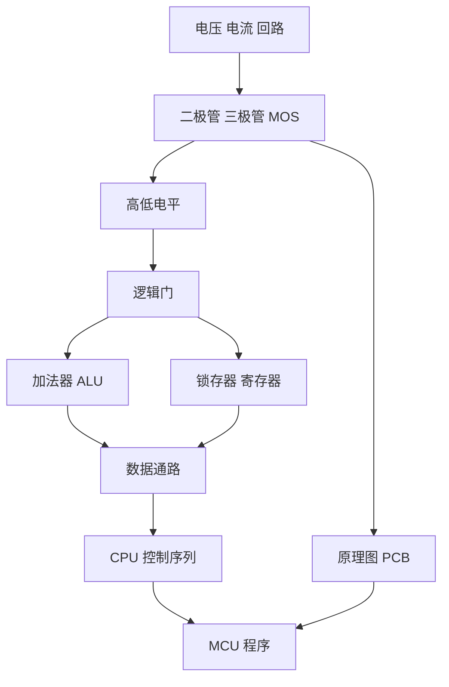

# 嵌入式基础技术路线

## 从电气现象到程序行为

这套学习资产形成了一条连续链路，而不是彼此独立的课程章节。

1. **电子电路**解释电源、回路、压降、分流和器件导通条件。
2. **数字逻辑**把稳定电压区间抽象为 0/1，用逻辑门实现布尔运算。
3. **组合与时序电路**用加法器处理数据，用锁存器和寄存器保存状态。
4. **计算机组成**用总线连接 ALU、寄存器、内存和控制器，通过时钟执行微操作。
5. **PCB 与接口**把抽象信号落实到芯片引脚、网络、封装和可制造电路板。
6. **硬件控制程序**通过 GPIO、PWM 和 UART 控制真实外设。

## 现有能力证据

| 能力 | 工程证据 | 可继续补强的证据 |
| --- | --- | --- |
| 电路分析 | CircuitJS 串并联、整流、晶体管、MOS、比较器 | 实测电压/电流和波形 |
| 组合逻辑 | Digital 半/全加器、8 位加法器、ALU 原型 | 全输入自动化测试与延迟分析 |
| 时序与组成 | 寄存器、内存、PC、CPU 手动/自动工程 | 逐拍运行录屏和状态表 |
| 硬件设计 | SVG 原理图、参考线路、两份 BOM | EDA 原生工程、DRC、Gerber、实物板 |
| MCU 控制 | STC8 GPIO/PWM/UART 图形化工程 | C 版本、串口抓包、示波器/逻辑分析仪证据 |

## 与后续仓库的连接

- C/C++ 仓库承接接口、内存、模块化和状态机实现。
- STC89C52RC 仓库承接定时器、中断、串口、显示和传感器驱动。
- 蓝桥杯仓库承接资源受限条件下的多外设综合应用。
- STM32、FreeRTOS 和 Embedded Linux 是后续路线，不列为当前成果。
