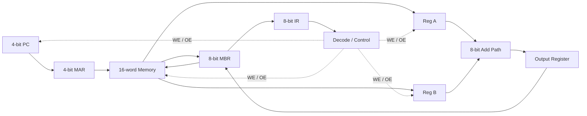

# 计算机组成与 CPU

## 1. 项目简介

这一部分把前面的门电路和加法器扩展为可执行程序的简化计算机。工程覆盖锁存器、寄存器、内存寻址、程序计数器、内部/外部总线、指令寄存器和控制序列，并保留手动测试、手动完整和自动运行三个 CPU 版本。

## 2. 技术背景

ALU 只能计算，寄存器只能暂存，内存只能按地址读写。CPU 的关键是让这些部件在时钟约束下按顺序协作。这个工程用 8 位数据通路和 4 位地址空间把数据流、控制流和指令格式放进同一仿真模型。

## 3. 系统结构



数据和控制的基本顺序是：

```text
PC → MAR → Memory → MBR → IR → Decode → Register/ALU/Memory
```

## 4. 工程版本

| 文件 | 用途 |
| --- | --- |
| [手动测试版](course/digital/计算机CPU设计%28手动测试版%29.dig) | 独立验证寄存器、ALU 和总线控制 |
| [手动完整版](course/digital/计算机CPU设计%28手动完整版%29.dig) | 手动切换各模块 WE/OE，观察完整数据通路 |
| [自动完整版](course/digital/计算机CPU设计%28自动完整版%29.dig) | 使用 Clock、计数器和 LookUpTable 自动生成控制动作 |
| [17 位操作机器码](course/programs/17位操作机器码.hex) | 自动控制器查找表内容 |
| [3 + 5 程序](course/programs/计算机3+5程序.hex) | 内存中的 LOAD/ADD/STORE 示例程序 |

重复出现在 day06/day07 的 ALU、4 位寄存器、8 位寄存器和手动 CPU 文件具有相同 SHA-256，仓库只保留一份。

## 5. 核心实现

### 指令与数据

示例程序包含四条核心指令：

| 操作码 | 指令 | 数据流 |
| --- | --- | --- |
| `0000` | `LOAD_A address` | `Memory[address] → RegA` |
| `0001` | `LOAD_B address` | `Memory[address] → RegB` |
| `0010` | `ADD` | `RegA + RegB → Output Register` |
| `0011` | `STORE address` | `Output Register → Memory[address]` |

8 位指令拆成高 4 位操作码和低 4 位操作数。PC 输出 4 位地址，MAR 选择 16 个内存位置；MBR 在内存与内部数据通路之间缓存 8 位内容；IR 保存当前指令并向控制逻辑提供操作码和地址字段。

### 取指

1. `PC.OE + MAR.WE`：把下一条指令地址写入 MAR。
2. `MAR.OE + Memory.OE + MBR.WE`：将对应内存字读入 MBR。
3. `MBR.OE + IR.WE`：把指令装入 IR。

### 执行

控制器依据 IR 中的操作码选择微操作序列。LOAD 指令还会通过 MAR/Memory/MBR 读取操作数；ADD 同时使能 RegA、RegB 和 ALU，并写入输出寄存器；STORE 将输出寄存器经 MBR 写回指定内存地址。

自动版本把指令类别和步骤序号组合为查找表地址。17 位控制字分别连接各模块的 WE/OE 与控制信号，并以 8 步对齐不同指令的微操作序列。

## 6. 技术难点

- 同一总线每个时刻只能有一个有效驱动源，避免总线竞争。
- WE 与 OE 含义相反：一个决定是否接收数据，一个决定是否驱动数据。
- 取指地址、指令内容和操作数地址必须在 4/8 位总线上正确拆分。
- PC、微步骤计数器和 Clock 的更新顺序决定指令能否连续执行。
- 自动控制表必须对未使用步骤填入无操作，防止残留控制信号误写寄存器或内存。

## 7. 调试与验证

验证建议按组件到系统逐级进行：

1. 单独检查 [锁存器](course/digital/锁存器.dig)、[4 位寄存器](course/digital/4位寄存器.dig)、[8 位寄存器](course/digital/8位寄存器.dig)与[程序计数器](course/digital/程序计数器.dig)。
2. 用手动测试版验证两个寄存器输入和 ALU 输出。
3. 在手动完整版中逐步切换 WE/OE，对照 [MAR 查找内存示意](assets/通过MAR中的数据查找内存中的指令.png)。
4. 给自动完整版载入两个 HEX 文件，逐拍观察 PC、IR、MBR、寄存器和内存写回。

仓库保留了可执行仿真工程和程序镜像；没有把课程演示截图写成新的板级测试结果。

## 8. 工程意义

这个工程把“软件指令”还原为一系列电气控制动作：时钟推动状态变化，控制字决定数据源和目的地，总线承担搬运，寄存器保存阶段结果。它为理解 MCU 寄存器、总线、指令周期、中断保存现场和流水线打下了底层模型基础。

## 9. 展示

仓库已经包含关键结构图和 Digital 工程。后续可加入自动运行逐拍截图或录屏，重点展示 `LOAD_A → LOAD_B → ADD → STORE` 期间各寄存器和内存的变化。
